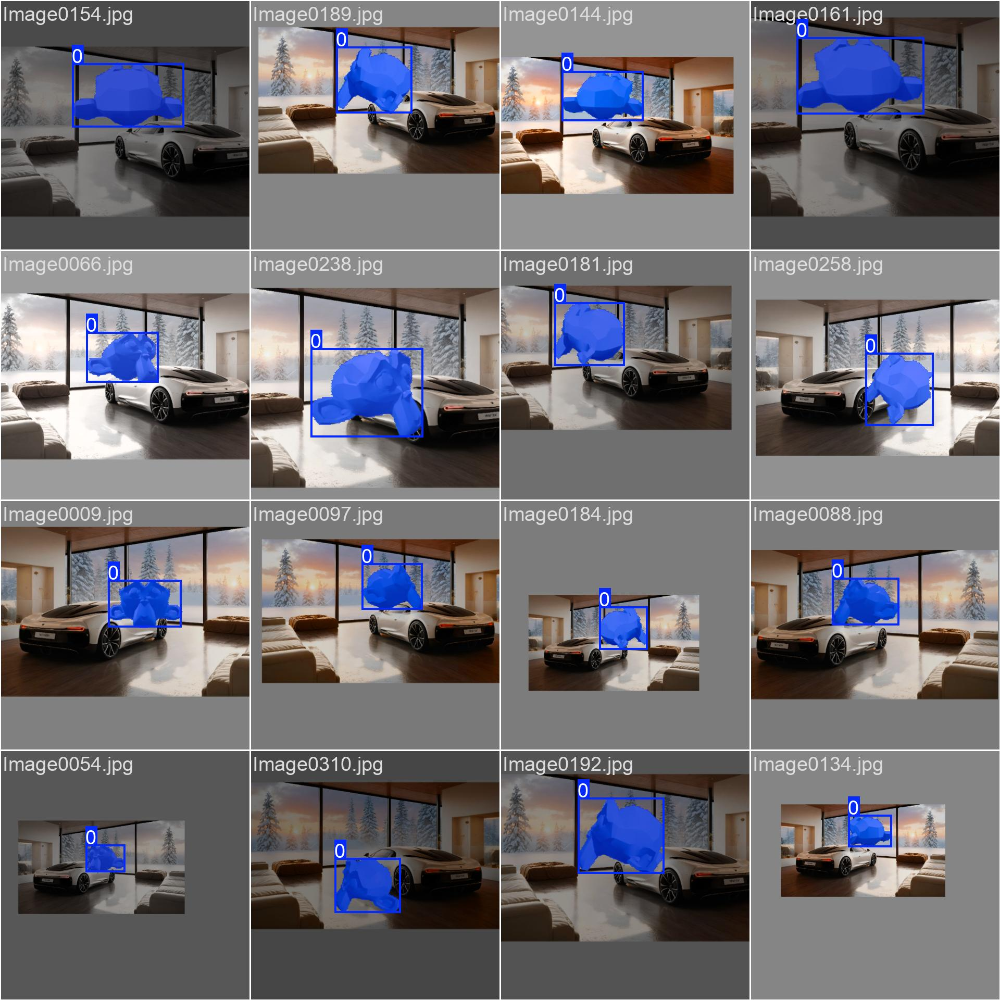
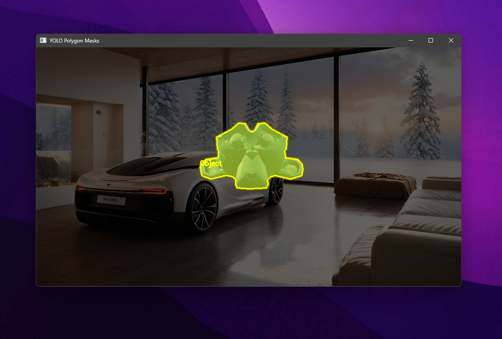
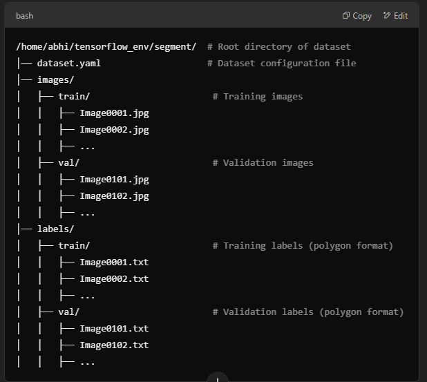
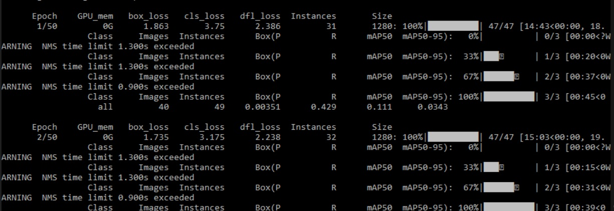
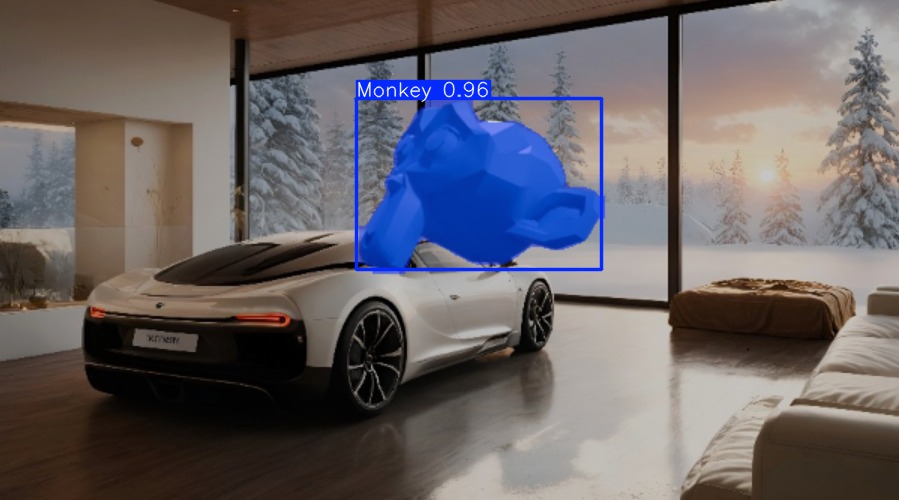

# Synthetic-Data-Generation-for-Computer-Vision-AI-ML

# Large Scale (Synthetic Data Generation) for Masked image segmentation using Blender 3D software for DEEP LEARNING - Computer Vision(YOLO)
        -by Abhishek Verma

Training Batch image:-


Project Overview:-

        This project demonstrates the process of synthetic data generation for deep learning and computer vision models, with a focus on polygon-based segmentation using YOLO annotations. Synthetic data generation plays a vital role in training models when real-world labeled data is scarce, expensive, or hard to obtain. By simulating realistic datasets through algorithms or 3D rendering, we can augment training sets for better model accuracy and generalization.


What is Synthetic Data Generation?:-


Synthetic data generation refers to the creation of artificial data designed to simulate real-world data. In the context of deep learning and computer vision, synthetic data is generated for tasks such as image segmentation, object detection, and classification. It is created using a variety of methods, including:

3D Rendering: Computer-generated images are produced using simulation tools, often using detailed models to simulate real-world environments.
Augmentation: Manipulating existing real-world data (e.g., flipping, rotating, color-changing) to create new training examples.
Generative Models: Deep learning models, such as GANs (Generative Adversarial Networks), create entirely new images that resemble real data.
Benefits of Synthetic Data in Deep Learning and Computer Vision
Overcoming Data Scarcity: Synthetic data is crucial when real-world data is limited, as it allows you to create large, diverse datasets for training.


Cost-Effective:-
                
        Creating synthetic data is often cheaper than collecting, annotating, and cleaning real-world data.

Data Diversity:-
                
        Synthetic data allows for fine-grained control over the dataset, ensuring a wide variety of scenarios, object variations, and conditions.

Handling Imbalanced Datasets:-

        Synthetic data can be used to balance datasets, ensuring that underrepresented classes or scenarios receive more attention during training.

Privacy and Security:-

        In fields like healthcare, finance, and automotive, synthetic data allows the training of models without compromising sensitive information.


Project Description:-

        In this project, synthetic data is used for polygon segmentation tasks in computer vision. The project involves:

Training a YOLOv8 Model:-
        
        The model is trained on synthetic data, where each object is represented as a polygon rather than a simple bounding box.

Displaying Predictions: The YOLO model’s predictions are visualized by drawing polygons over objects detected in images.

Real-World Application: This method of using synthetic data can be used to generate training data for real-world problems such as autonomous vehicles, medical imaging, and industrial robotics.

How Does This Project Work?:-

        The model is trained using YOLO annotations in the form of polygons (not just bounding boxes).
        The system reads the image and label files, where labels define the polygons representing each object.
        These polygons are drawn over the image, simulating the detection of objects.
        The trained model can be deployed to predict objects and draw polygons in real-time on new images.
        Synthetic Data Generation Applications in the Future
        As deep learning and computer vision continue to evolve, synthetic data generation will become increasingly important. 


#Here, We Using Blender because its has very vast potential for 3D renderings prespectives and also for Synthetic Data generation...

* imp Notes:-
1. To hide a object select object and and enable Mask -> HOLDOUT
2. dont set any name for compositor File output saving path
3. background = Film > Transparent
4. object to be trained should be white(255,255,255) and background(0,0,0)
5. name of both rendered image compositor image should be same, during rendering
6. images must save in 2 different folders named as (Images & Mask)


#Convert Masked-image to polygons annotations .txt file------------black = background/ white = object masked


Getting Started
Prerequisites
Python 3.x
OpenCV (cv2)
NumPy
YOLOv8 Model (Pretrained or Custom Trained)
Labels in YOLO format (polygon-based)
Installation


```python
import cv2
import numpy as np
import os

def mask_to_polygon(mask_image, epsilon=0.002):  # Use adaptive polygon approximation
    # Read the mask in grayscale
    img = cv2.imread(mask_image, cv2.IMREAD_GRAYSCALE)

    # Apply binary threshold
    _, binary_mask = cv2.threshold(img, 127, 255, cv2.THRESH_BINARY)

    # Find contours with hierarchy detection
    contours, _ = cv2.findContours(binary_mask, cv2.RETR_EXTERNAL, cv2.CHAIN_APPROX_SIMPLE)

    polygons = []

    for contour in contours:
        # Approximate the contour to reduce points adaptively
        epsilon_value = epsilon * cv2.arcLength(contour, True)
        approx = cv2.approxPolyDP(contour, epsilon_value, True)

        # Normalize points to YOLO format
        normalized_points = [(point[0][0] / img.shape[1], point[0][1] / img.shape[0]) for point in approx]
        
        # Ensure the polygon is closed
        if len(normalized_points) > 2 and normalized_points[0] != normalized_points[-1]:
            normalized_points.append(normalized_points[0])

        # Format as YOLO annotation
        polygons.append(" ".join([f"{x} {y}" for x, y in normalized_points]))

    return polygons

# Input/output folders
input_folder = "C:\\3D\\bin\\images\\mask"  
output_folder = "C:\\3D\\bin\\images\\label"  

# Ensure the output folder exists
os.makedirs(output_folder, exist_ok=True)

# Process all mask images
for mask_image in os.listdir(input_folder):
    if mask_image.endswith(".png"):  
        mask_image_path = os.path.join(input_folder, mask_image)
        
        # Convert mask to YOLO polygons
        polygons = mask_to_polygon(mask_image_path, epsilon=0.002)
        
        # Save the polygons as YOLO labels
        label_file_path = os.path.join(output_folder, os.path.splitext(mask_image)[0] + ".txt")
        
        with open(label_file_path, "w") as f:
            for polygon in polygons:
                f.write(f"0 {polygon}\n")  

        print(f"Saved annotations for {mask_image}")

print("Finished processing all images.")
```




```python
import cv2
import numpy as np

def draw_yolo_polygons(image_path, label_path, class_names=None):
    # Load image
    image = cv2.imread(image_path)
    height, width, _ = image.shape  # Ensure this is 640x640
    
    with open(label_path, "r") as file:
        lines = file.readlines()
    
    for line in lines:
        data = line.strip().split()
        class_id = int(data[0])
        points = list(map(float, data[1:]))
        
        # Convert YOLO format (normalized) to pixel coordinates
        polygon_points = []
        for i in range(0, len(points), 2):
            x = int(points[i] * width)
            y = int(points[i + 1] * height)
            polygon_points.append((x, y))

        # Ensure that the polygon is closed, no diagonals
        polygon_points = np.array(polygon_points, np.int32)
        polygon_points = polygon_points.reshape((-1, 1, 2))
        
        # Drawing the polygon outline (yellow) with a smooth edge
        cv2.polylines(image, [polygon_points], isClosed=True, color=(0, 255, 255), thickness=3)  # Yellow
        
        # Fill the polygon with a semi-transparent color for selection effect
        mask = np.zeros_like(image, dtype=np.uint8)
        cv2.fillPoly(mask, [polygon_points], (0, 255, 255))  # Fill yellow
        alpha = 0.5  # Adjust transparency level for selection effect
        cv2.addWeighted(mask, alpha, image, 1 - alpha, 0, image)

        # Add label text if class names are provided
        if class_names:
            label = class_names[class_id] if class_id < len(class_names) else str(class_id)
            # Place the label near the top-left corner of the polygon
            cv2.putText(image, label, (polygon_points[0][0][0], polygon_points[0][0][1] - 5),
                        cv2.FONT_HERSHEY_SIMPLEX, 0.5, (0, 255, 255), 2)

    # Show the image with polygon outlines
    cv2.imshow("YOLO Polygon Masks", image)
    cv2.waitKey(0)
    cv2.destroyAllWindows()

# Example usage (Ensure these paths are correct)
image_path = r"C:\\3D\bin\\images\\images\\train\\Image0001.jpg"   # Image file
label_path = r"C:\\3D\bin\\images\\labels\\train\\Image0001.txt"   # YOLO label file
class_names = ["Object"]  # Add correct class names if available

draw_yolo_polygons(image_path, label_path, class_names)
```

#Set the correct Directory structure

Required files:-
1. dataset.yaml
1. classes.txt




#Train the model using dataset.yaml

* dataset.yaml data example:-

        path: /home/abhi/tensorflow_env/segment/ # Root directory of your dataset
    
        train: /home/abhi/tensorflow_env/segment/images/train/ # Path to training images
    
        val: /home/abhi/tensorflow_env/segment/images/val/  # Path to validation images
    
        nc: 1  # Number of classes (1 for 'match')
    
        names: ["Monkey"]  # Class name


#Train yolo model(neural network) using image-segmentation-polygons labels dataset------------------start-------------

after training, trained model present in same_dir > runs > train > weights > last.pt



```python
from ultralytics import YOLO

# Define the path to your dataset YAML file
dataset_yaml_path = "dataset.yaml"

# Initialize the YOLO model with the configuration for segmentation (YOLOv8 small, for example)
model = YOLO('yolov8n-seg.yaml')  # You can choose other variants like yolov8l-seg.yaml

# Train the model
model.train(data=dataset_yaml_path, epochs=100, imgsz=640)

# Optionally, you can save the trained model
model.save("trained_model.pt")
#yolo task=segment mode=train model=yolov8n-seg.pt data=dataset.yaml epochs=100
```

#IMAGE------------Detect object-segment using IMAGE 



```python
from ultralytics import YOLO
import cv2

# Load the YOLOv8 segmentation model
model = YOLO("monkey_predict_model.pt").to('cuda')  # Replace with your model path

# Load an image
image_path = "C:\\3D\\bin\\images\\images\\train\\Image0085.jpg"  # Change to your image path
image = cv2.imread(image_path)

# Run inference on the image
results = model(image)

# Check if results are returned as a list
if isinstance(results, list):
    result = results[0]  # Get the first result (usually there's only one)
else:
    result = results  # Otherwise, use the result directly

# Plot the results (segmentation masks will automatically be drawn)
result.show()  # This will display the image with segmentation results

# Optionally, you can also save the results to a file
#result.save()  # Saves the result to 'runs/detect/exp'
```

#VIDEO--------------------------Detect object-segment using VIDEO

```python
import cv2
from ultralytics import YOLO

# Load trained model and ensure it uses the GPU
model = YOLO("monkey_predict_model.pt").to('cuda')  # Load on GPU

# Open video file (replace 'video.mp4' with the path to your video)
video_path = "C:\\3D\\bin\\images\\vid0001-0400.mkv"
cap = cv2.VideoCapture(video_path)

# Check if the video was opened successfully
if not cap.isOpened():
    print("Error: Couldn't open video file.")
    exit()

# Create a single window for displaying results
cv2.namedWindow("YOLOv8 Video Detection", cv2.WINDOW_NORMAL)

while cap.isOpened():
    ret, frame = cap.read()
    if not ret:
        break

    # Resize the frame to lower resolution for faster processing (e.g., 640x480)
    frame_resized = cv2.resize(frame, (640, 480))

    # Run YOLO on the resized frame with a lower confidence threshold
    results = model(frame_resized, conf=0.6)

    # Check if results are available and have detections
    if results:
        # Access the predictions (results[0] is a Result object)
        result = results[0]  # This is a Result object
        
        if result.boxes:
            # Access the bounding boxes and confidence scores
            boxes = result.boxes
            if len(boxes) > 0:  # Check if any boxes are detected
                # Plot results on the frame
                annotated_frame = result.plot()

                # Display the annotated frame
                cv2.imshow("YOLOv8 Video Detection", annotated_frame)
            else:
                # Display the original frame if no boxes detected
                cv2.imshow("YOLOv8 Video Detection", frame_resized)
        else:
            # Display the original frame if no detections
            cv2.imshow("YOLOv8 Video Detection", frame_resized)
    else:
        # Display the original frame if no detections
        cv2.imshow("YOLOv8 Video Detection", frame_resized)

    # Exit when 'q' is pressed
    if cv2.waitKey(1) & 0xFF == ord('q'):
        break

cap.release()
cv2.destroyAllWindows()
```
#CAMERA-----------------Detect object-segment using CAMERA 

```python
import cv2
from ultralytics import YOLO

# Load trained model and ensure it uses the GPU
model = YOLO("monkey_predict_model.pt") # Load on GPU

# Open webcam
cap = cv2.VideoCapture(0)

# Create a single window for displaying results
cv2.namedWindow("YOLOv8 Webcam Detection", cv2.WINDOW_NORMAL)

while cap.isOpened():
    ret, frame = cap.read()
    if not ret:
        break

    # Run YOLO on the frame with a lower confidence threshold
    results = model(frame, conf=0.94)

    # Check if results are available and have detections
    if results:
        # Access the predictions (results[0] is a Result object)
        result = results[0]  # This is a Result object
        
        if result.boxes:
            # Access the bounding boxes and confidence scores
            boxes = result.boxes
            if len(boxes) > 0:  # Check if any boxes are detected
                # Plot results on the frame
                annotated_frame = result.plot()

                # Display the annotated frame
                cv2.imshow("YOLOv8 Webcam Detection", annotated_frame)
            else:
                # Display the original frame if no boxes detected
                cv2.imshow("YOLOv8 Webcam Detection", frame)
        else:
            # Display the original frame if no detections
            cv2.imshow("YOLOv8 Webcam Detection", frame)
    else:
        # Display the original frame if no detections
        cv2.imshow("YOLOv8 Webcam Detection", frame)

    # Exit when 'q' is pressed
    if cv2.waitKey(1) & 0xFF == ord('q'):
        break

cap.release()
cv2.destroyAllWindows()
```

#DISPLAY----------------Detect object-segment using DISPLAY CAPTURE

*pip install opencv-python numpy mss ultralytics

```python
import cv2
import numpy as np
import mss
from ultralytics import YOLO

# Load YOLO model on GPU
model = YOLO("monkey_predict_model.pt").to('cuda')

# Define screen capture region (full screen)
with mss.mss() as sct:
    screen_width = sct.monitors[1]["width"]
    screen_height = sct.monitors[1]["height"]
    monitor = {"top": 0, "left": 0, "width": screen_width, "height": screen_height}

# Create a window for displaying the screen
cv2.namedWindow("Screen Detection", cv2.WINDOW_NORMAL)
cv2.resizeWindow("Screen Detection", 800, 450)  # Resize window for a smaller display

while True:
    with mss.mss() as sct:
        # Capture the screen
        screenshot = sct.grab(monitor)

        # Convert to a NumPy array
        frame = np.array(screenshot)

        # Convert from BGRA to BGR (OpenCV format)
        frame = cv2.cvtColor(frame, cv2.COLOR_BGRA2BGR)

        # Run YOLO on the captured screen
        results = model(frame, conf=0.6)

        # Annotate detected objects
        annotated_frame = results[0].plot()

        # Resize the frame for display
        small_frame = cv2.resize(annotated_frame, (800, 450))

        # Show the captured screen with predictions
        cv2.imshow("Screen Detection", small_frame)

    # Exit on pressing 'q'
    if cv2.waitKey(1) & 0xFF == ord('q'):
        break

cv2.destroyAllWindows()
```


Below are several potential applications and use cases for synthetic data in future computer vision systems:

Autonomous Vehicles: Training self-driving cars involves understanding numerous real-world scenarios, such as different weather conditions, traffic patterns, and obstacles. Synthetic data allows for the generation of varied traffic situations that are difficult to capture in the real world.

Healthcare and Medical Imaging: In medical imaging, training a deep learning model requires a vast amount of annotated medical images. Synthetic data can help generate medical datasets, allowing for the detection of diseases like cancer, without requiring a large number of real patient scans.

Retail and Product Recognition: In e-commerce, synthetic data can be generated to train models to recognize various products in different environments. This helps in inventory management, object detection, and providing customers with personalized recommendations.

Robotics: Robots require diverse datasets for object manipulation and environment interaction. Synthetic data can generate various objects and settings to train robots in numerous real-world tasks without requiring physical objects.

Industrial Safety: Predicting potential safety hazards in industrial settings can be achieved by generating synthetic data that simulates hazardous conditions, ensuring that safety systems are robust even in rare scenarios.

Augmented Reality (AR) and Virtual Reality (VR): Synthetic data can be used to create realistic 3D environments for AR and VR applications, aiding in training models for human-object interaction and environment recognition.

Acknowledgments:-

        YOLOv8: Ultralytics YOLO
        OpenCV: OpenCV Documentation


