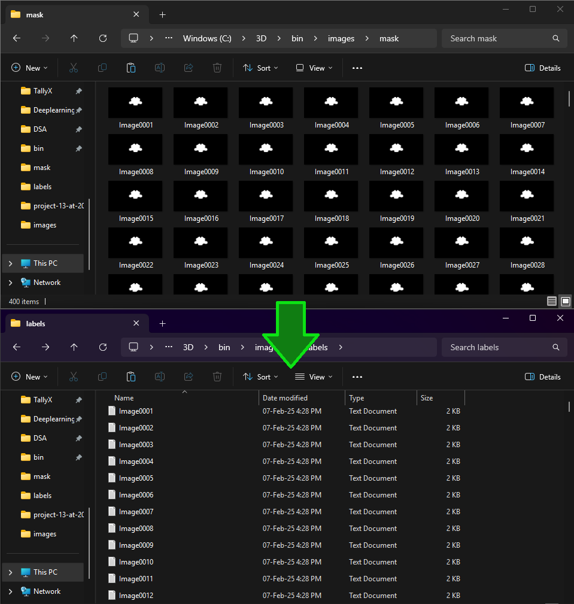

# Synthetic-Data-Generation-for-Computer-Vision-AI-ML
# Large Scale (Synthetic Data Generation) for Masked image segmentation using Blender 3D software for DEEP LEARNING - Computer Vision(YOLO)
        -by Abhishek Verma

#Using Blender for Synthetic Data generation, name of both rendered image compositor image should be same, during rendering, images must save in 2 different folders named as (Images & Mask)

* imp Notes:-
1. To hide a object select object and and enable Mask -> HOLDOUT
2. dont set any name for compositor File output saving path
3. background = Film > Transparent
4. object to be trained should be white(255,255,255) and background(0,0,0)


#Convert Masked-image to polygons annotations .txt file------------black = background/ white = object masked




```python
def greet(name):
    return f"Hello, {name}!"

print(greet("World"))
